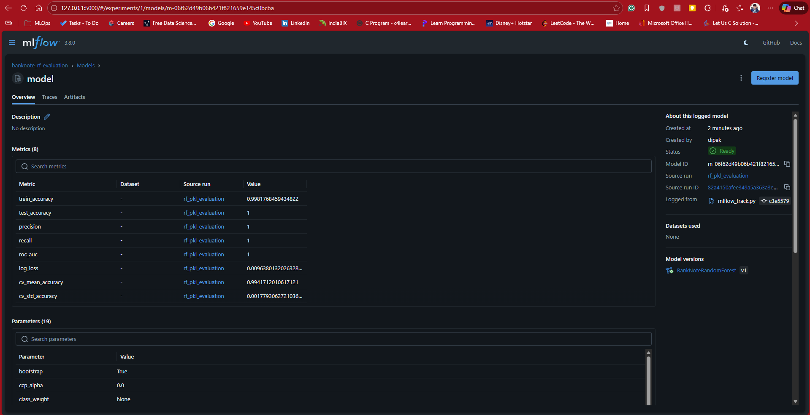
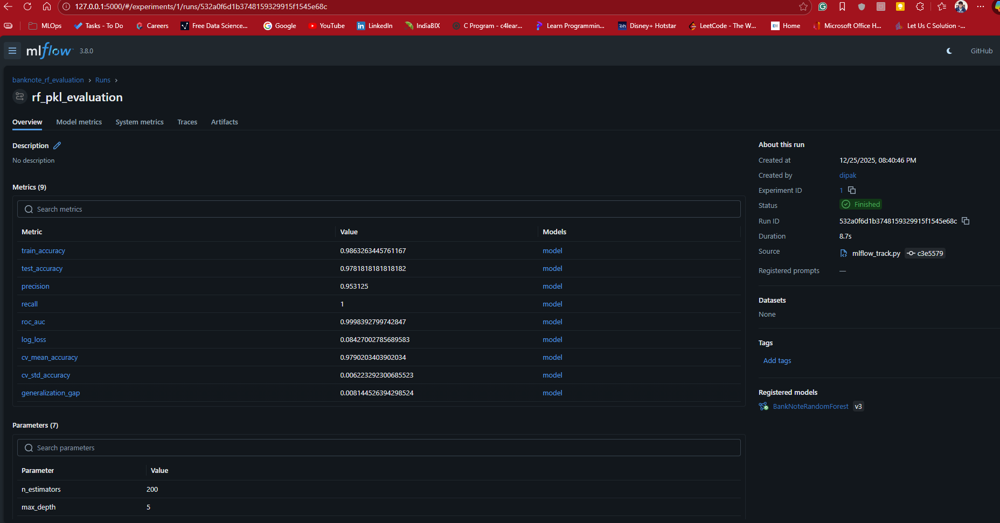

Bank Note Authentication
========================

[Data Source](https://www.kaggle.com/datasets/ritesaluja/bank-note-authentication-uci-data)

This repository contains a machine learning project focused on bank note authentication. The dataset used for this project is sourced from Kaggle and contains features extracted from images of genuine and forged bank notes.


Once your project is set and ready. 

Prepare the dockerfile

```
docker build -t banknote-api .
```
Check the image created

```
docker images
```

See the running containers

```
docker ps
```

Run the docker container

```
docker run -p 5000:5000 banknote-api
```


# Model performance tracking with mlflow and logging
Refer to the code in `mlflow_track.py` for implementation details.

# Installation of mlflow

```
pip install mlflow
```

# Lunch mlflow UI

```
mlflow ui
```

Experiment Note: Banknote Authentication Model – Random Forest


Previous Experiment Observations:



Interpretation:
The model was performing extremely well, almost perfectly separating authentic vs forged notes.

The generalization gap was not added, indicating overfitting, but due to the high performance and relatively small dataset (~1,372 samples), we needed to be cautious about data leakage or overconfidence.

Recall was perfect, meaning no forged notes were missed — which is critical for this application.

Precision was slightly lower than recall, indicating a few valid notes were incorrectly flagged as forged — acceptable depending on the tolerance for false positives in a real-world setting.


Current Experiment Updates:

Config-Driven Training:
```
MODEL_TYPE = "random_forest"
MODEL_PARAMS = {
    "n_estimators": 200,
    "max_depth": 5,
    "min_samples_leaf": 10,
    "min_samples_split": 20,
    "max_features": "sqrt",
    "random_state": 42,
    "n_jobs": -1,
}
```
Model parameters, run name, experiment name, and registered model name are now controlled via a config file.

This allows flexibility to update hyperparameters without changing the main code.

Cross-Validation Fix:

Cross-validation is now computed only on training data, preventing any leakage from the test set.

Provides a more realistic estimate of model stability and variance.

Artifacts Management:

Confusion matrix and classification report are now saved in a dedicated models/ folder.

Ensures logs and artifacts are organized and reproducible.

Generalization Awareness:

Added generalization_gap metric in MLflow, highlighting potential overfitting in a single glance.

Metrics and Insights:

Train Accuracy: 0.986

Test Accuracy: 0.978

Precision: 0.953

Recall: 1.0

ROC-AUC: 0.9998

Log Loss: 0.084

Cross-Validation Accuracy: 0.979 ± 0.006

Generalization Gap: 0.008

Interpretation:

Metrics are almost identical to the previous run, but now they are better organized and fully tracked.

Small generalization gap confirms that the model is robust and stable.

Cross-validation indicates low variance, meaning the model performs consistently across different splits of the data.

Model is ready for explainability analysis, which can guide business stakeholders in understanding why a note is classified as forged.

Next Steps / Recommendations:

Feature Importance: Identify which features contribute the most to classification.

SHAP Analysis: Explain predictions locally (per note) and globally (overall dataset).

Partial Dependence Plots (PDP): Visualize how each feature affects the prediction.

Threshold Tuning: Adjust decision threshold to balance precision and recall depending on the business requirements.

Monitor Overfitting: Even with a small generalization gap, we should validate on completely new, unseen data.

Conclusion:
The current experiment demonstrates a well-performing, stable, and fully tracked model for banknote authentication. With the MLflow pipeline and artifact management in place, the workflow is reproducible, configurable, and explainable, making it ready for real-world deployment and further model interpretability analysis.


